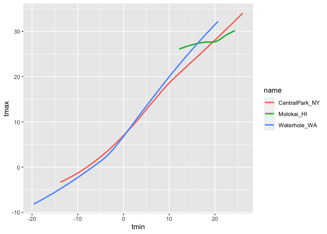
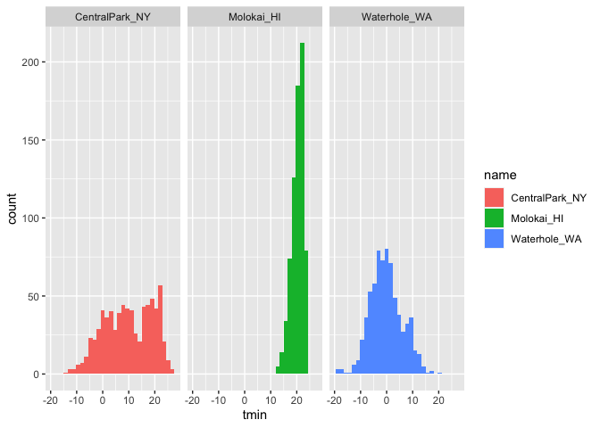
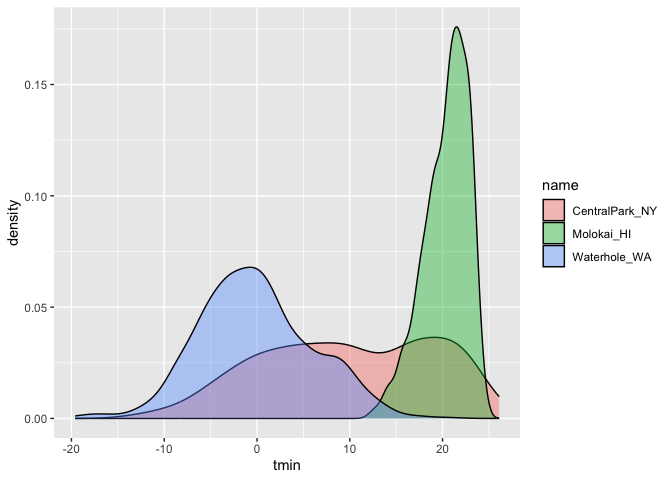
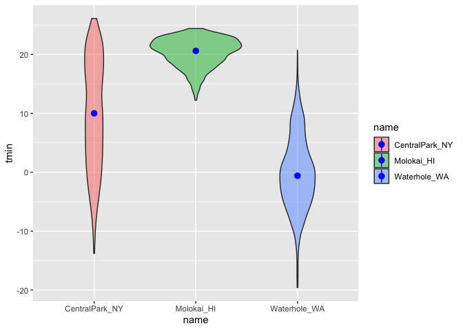

visualization 1
================
Nhu Nguyen
2023-10-05

loading necessary libraries

``` r
library(tidyverse)
```

    ## ── Attaching core tidyverse packages ──────────────────────── tidyverse 2.0.0 ──
    ## ✔ dplyr     1.1.3     ✔ readr     2.1.4
    ## ✔ forcats   1.0.0     ✔ stringr   1.5.0
    ## ✔ ggplot2   3.4.3     ✔ tibble    3.2.1
    ## ✔ lubridate 1.9.2     ✔ tidyr     1.3.0
    ## ✔ purrr     1.0.2     
    ## ── Conflicts ────────────────────────────────────────── tidyverse_conflicts() ──
    ## ✖ dplyr::filter() masks stats::filter()
    ## ✖ dplyr::lag()    masks stats::lag()
    ## ℹ Use the conflicted package (<http://conflicted.r-lib.org/>) to force all conflicts to become errors

``` r
library(ggridges)
```

## loading the weather data

``` r
weather_df = 
  rnoaa::meteo_pull_monitors(
    c("USW00094728", "USW00022534", "USS0023B17S"),
    var = c("PRCP", "TMIN", "TMAX"), 
    date_min = "2021-01-01",
    date_max = "2022-12-31") |>
  mutate(
    name = recode(
      id, 
      USW00094728 = "CentralPark_NY", 
      USW00022534 = "Molokai_HI",
      USS0023B17S = "Waterhole_WA"),
    tmin = tmin / 10,
    tmax = tmax / 10) |>
  select(name, id, everything())
```

    ## using cached file: /Users/nhunguyen/Library/Caches/org.R-project.R/R/rnoaa/noaa_ghcnd/USW00094728.dly

    ## date created (size, mb): 2023-10-04 20:49:04 (8.527)

    ## file min/max dates: 1869-01-01 / 2023-10-31

    ## using cached file: /Users/nhunguyen/Library/Caches/org.R-project.R/R/rnoaa/noaa_ghcnd/USW00022534.dly

    ## date created (size, mb): 2023-10-04 20:49:16 (3.832)

    ## file min/max dates: 1949-10-01 / 2023-10-31

    ## using cached file: /Users/nhunguyen/Library/Caches/org.R-project.R/R/rnoaa/noaa_ghcnd/USS0023B17S.dly

    ## date created (size, mb): 2023-10-04 20:49:20 (0.997)

    ## file min/max dates: 1999-09-01 / 2023-10-31

``` r
weather_df
```

    ## # A tibble: 2,190 × 6
    ##    name           id          date        prcp  tmax  tmin
    ##    <chr>          <chr>       <date>     <dbl> <dbl> <dbl>
    ##  1 CentralPark_NY USW00094728 2021-01-01   157   4.4   0.6
    ##  2 CentralPark_NY USW00094728 2021-01-02    13  10.6   2.2
    ##  3 CentralPark_NY USW00094728 2021-01-03    56   3.3   1.1
    ##  4 CentralPark_NY USW00094728 2021-01-04     5   6.1   1.7
    ##  5 CentralPark_NY USW00094728 2021-01-05     0   5.6   2.2
    ##  6 CentralPark_NY USW00094728 2021-01-06     0   5     1.1
    ##  7 CentralPark_NY USW00094728 2021-01-07     0   5    -1  
    ##  8 CentralPark_NY USW00094728 2021-01-08     0   2.8  -2.7
    ##  9 CentralPark_NY USW00094728 2021-01-09     0   2.8  -4.3
    ## 10 CentralPark_NY USW00094728 2021-01-10     0   5    -1.6
    ## # ℹ 2,180 more rows

## scatterplots!!

create my first scatterplot ever

``` r
ggplot(weather_df, aes(x = tmin, y = tmax)) +
  geom_point()
```

    ## Warning: Removed 17 rows containing missing values (`geom_point()`).

<!-- -->

new approach, same plot

``` r
weather_df %>% 
  ggplot(aes(x = tmin, y = tmax)) + 
  geom_point()
```

    ## Warning: Removed 17 rows containing missing values (`geom_point()`).

<!-- -->

save and edit a plot object

``` r
weather_plot = 
  weather_df %>% 
  ggplot(aes(x = tmin, y = tmax))

weather_plot + geom_point()
```

    ## Warning: Removed 17 rows containing missing values (`geom_point()`).

<!-- -->

## advanced scatterplot

start with the same one and make it fancy!

``` r
weather_df %>% 
  ggplot(aes(x = tmin, y = tmax, color = name)) + 
  geom_point() + 
  geom_smooth (se = FALSE)
```

    ## `geom_smooth()` using method = 'loess' and formula = 'y ~ x'

    ## Warning: Removed 17 rows containing non-finite values (`stat_smooth()`).

    ## Warning: Removed 17 rows containing missing values (`geom_point()`).

<!-- -->

what about the `aes` placement?

``` r
weather_df %>% 
  ggplot(aes(x = tmin, y = tmax)) + 
  geom_point(aes(color = name)) + 
    geom_smooth()
```

    ## `geom_smooth()` using method = 'gam' and formula = 'y ~ s(x, bs = "cs")'

    ## Warning: Removed 17 rows containing non-finite values (`stat_smooth()`).

    ## Warning: Removed 17 rows containing missing values (`geom_point()`).

<!-- -->

let’s facet some things!!

``` r
ggplot(weather_df, aes(x = tmin, y = tmax, color = name)) + 
  geom_point(alpha = 0.5) +
  geom_smooth(se = FALSE) + 
  facet_grid(. ~ name)
```

    ## `geom_smooth()` using method = 'loess' and formula = 'y ~ x'

    ## Warning: Removed 17 rows containing non-finite values (`stat_smooth()`).

    ## Warning: Removed 17 rows containing missing values (`geom_point()`).

<!-- -->
facet function - ‘.’ means don’t create rows, but create columns that
describe name variable alhpa refers to the transparency of the points,
can also change size

let’s combine some elements and try a new plot

``` r
weather_df %>% 
  ggplot(aes(x = date, y = tmax, color = name)) +
  geom_point(aes(size = prcp), alpha = 0.5) + 
  geom_smooth(se = FALSE) + 
  facet_grid(. ~ name)
```

    ## `geom_smooth()` using method = 'loess' and formula = 'y ~ x'

    ## Warning: Removed 17 rows containing non-finite values (`stat_smooth()`).

    ## Warning: Removed 19 rows containing missing values (`geom_point()`).

<!-- -->

\##some small notes

how many geoms have to exist?

you can have whatever geoms you want - may not be the most useful though
if you only have the geom_smooth function

``` r
weather_df %>% 
  ggplot(aes(x = tmin, y = tmax, color = name)) +
  geom_smooth(se = FALSE)
```

    ## `geom_smooth()` using method = 'loess' and formula = 'y ~ x'

    ## Warning: Removed 17 rows containing non-finite values (`stat_smooth()`).

<!-- -->

you can use neat geom!

geom_hex() gives me a 2D histogram, where brighter colors indicate more
data points – overkill for a data set with 1,000+ observations - helpful
for understanding what the data distribution might look like

``` r
weather_df %>% 
  ggplot(aes(x = tmin, y = tmax)) + 
  geom_hex()
```

    ## Warning: Removed 17 rows containing non-finite values (`stat_binhex()`).

<!-- -->

geom_bin2d makes the histogram points into squares

``` r
weather_df %>% 
  ggplot(aes(x = tmin, y = tmax)) + 
  geom_bin2d()
```

    ## Warning: Removed 17 rows containing non-finite values (`stat_bin2d()`).

<!-- -->
contour plot – similar to an elevation map - helpful when you have a
large data set

``` r
weather_df %>% 
  ggplot(aes(x = tmin, y = tmax)) + 
  geom_density2d() + 
  geom_point(alpha = .3)
```

    ## Warning: Removed 17 rows containing non-finite values (`stat_density2d()`).

    ## Warning: Removed 17 rows containing missing values (`geom_point()`).

<!-- -->

## univarate plots

histograms are really great

only looking at one variable

``` r
weather_df %>% 
  ggplot(aes(x = tmin)) +
  geom_histogram()
```

    ## `stat_bin()` using `bins = 30`. Pick better value with `binwidth`.

    ## Warning: Removed 17 rows containing non-finite values (`stat_bin()`).

<!-- -->

can we add color?

``` r
weather_df %>% 
  ggplot(aes(x = tmin, fill = name)) +
  geom_histogram() + 
  facet_grid(. ~ name)
```

    ## `stat_bin()` using `bins = 30`. Pick better value with `binwidth`.

    ## Warning: Removed 17 rows containing non-finite values (`stat_bin()`).

<!-- -->

histograms might not be the best graphs to show distribution of one
variable

let’s try a new geometry - density = histogram that’s been smooth out
around the edges - loose a little bit of information though but makes it
easier to compare shapes of distribution - good for exploration of data
set

``` r
weather_df %>% 
  ggplot(aes( x = tmin, fill = name)) + 
  geom_density(alpha = .4)
```

    ## Warning: Removed 17 rows containing non-finite values (`stat_density()`).

<!-- -->

what about box plots?

``` r
weather_df %>% 
  ggplot(aes(y = tmin)) + 
  geom_boxplot()
```

    ## Warning: Removed 17 rows containing non-finite values (`stat_boxplot()`).

<!-- --> -
gives one box plot of the overall distribution of tmin - the median,
min, max of the temperature mins

if we want to seperate by `name`: - strange because we are putting a
variable that is not a number on the x-axis - however, since it is a box
plot, it works out ok

``` r
weather_df %>% 
  ggplot(aes(x = name, y = tmin)) + 
  geom_boxplot()
```

    ## Warning: Removed 17 rows containing non-finite values (`stat_boxplot()`).

<!-- -->

trendy plots :-)

``` r
weather_df %>% 
  ggplot(aes(x = name, y = tmin, fill = name)) +
  geom_violin(alpha = .5) +
  stat_summary(fun = "median", color = "blue")
```

    ## Warning: Removed 17 rows containing non-finite values (`stat_ydensity()`).

    ## Warning: Removed 17 rows containing non-finite values (`stat_summary()`).

    ## Warning: Removed 3 rows containing missing values (`geom_segment()`).

<!-- --> -
violin plots: a cross mix of box plot and density plot - this is more
informative than box-plot about distribution shape

ridge plots – most popular plot of 2017 - when you want the
density/distribution on the x-axis and y is a predictor

``` r
weather_df %>% 
  ggplot(aes(x = tmin, y = name)) +
  geom_density_ridges()
```

    ## Picking joint bandwidth of 1.41

    ## Warning: Removed 17 rows containing non-finite values
    ## (`stat_density_ridges()`).

<!-- --> -
ridge plots are easier when you have a categorical predictor with 40+
variables - ex: if you wanted to know what the age distribution looked
like according to states, using box-plots or violin plots would be
difficult to graph – ridge plots end up being a useful option

## save and embed

let’s save a scatterplot

``` r
weather_plot = 
  weather_df %>% 
  ggplot(aes(x = tmin, y = tmax, color = name)) + 
  geom_point(alpha = .5)

ggsave("./results/weather_plot.pdf", weather_plot, width = 8, height = 5)
```

    ## Warning: Removed 17 rows containing missing values (`geom_point()`).

what about embedding? - are there ways we can control what specific
figures look like?

``` r
weather_plot
```

    ## Warning: Removed 17 rows containing missing values (`geom_point()`).

<!-- -->

embed at different size

``` r
weather_plot
```

    ## Warning: Removed 17 rows containing missing values (`geom_point()`).

<!-- -->

- made same plot, but it looks different when we knit – WHY?
  - first plot: we made the figure smaller but the points are the still
    same

we can also just set it so that every graph will have the same
dimensions

``` r
knitr::opts_chunk$set(
  fig.width = 6,
  fig.asp = .6,
  out.width = "90%"
)

ggplot(weather_df, aes(x = tmin, y = tmax)) + 
  geom_point(aes(color = name))
```

    ## Warning: Removed 17 rows containing missing values (`geom_point()`).

<!-- -->
