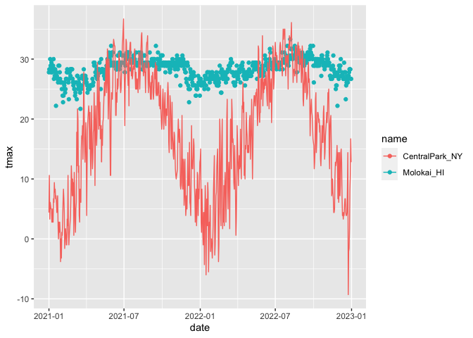

visualization 2
================
Nhu Nguyen
2023-10-05

loading necessary libraries

``` r
library(tidyverse)
```

    ## ── Attaching core tidyverse packages ──────────────────────── tidyverse 2.0.0 ──
    ## ✔ dplyr     1.1.3     ✔ readr     2.1.4
    ## ✔ forcats   1.0.0     ✔ stringr   1.5.0
    ## ✔ ggplot2   3.4.3     ✔ tibble    3.2.1
    ## ✔ lubridate 1.9.2     ✔ tidyr     1.3.0
    ## ✔ purrr     1.0.2     
    ## ── Conflicts ────────────────────────────────────────── tidyverse_conflicts() ──
    ## ✖ dplyr::filter() masks stats::filter()
    ## ✖ dplyr::lag()    masks stats::lag()
    ## ℹ Use the conflicted package (<http://conflicted.r-lib.org/>) to force all conflicts to become errors

``` r
library(patchwork)
```

## loading the weather data

``` r
weather_df = 
  rnoaa::meteo_pull_monitors(
    c("USW00094728", "USW00022534", "USS0023B17S"),
    var = c("PRCP", "TMIN", "TMAX"), 
    date_min = "2021-01-01",
    date_max = "2022-12-31") |>
  mutate(
    name = recode(
      id, 
      USW00094728 = "CentralPark_NY", 
      USW00022534 = "Molokai_HI",
      USS0023B17S = "Waterhole_WA"),
    tmin = tmin / 10,
    tmax = tmax / 10) |>
  select(name, id, everything())
```

    ## using cached file: /Users/nhunguyen/Library/Caches/org.R-project.R/R/rnoaa/noaa_ghcnd/USW00094728.dly

    ## date created (size, mb): 2023-10-04 20:49:04 (8.527)

    ## file min/max dates: 1869-01-01 / 2023-10-31

    ## using cached file: /Users/nhunguyen/Library/Caches/org.R-project.R/R/rnoaa/noaa_ghcnd/USW00022534.dly

    ## date created (size, mb): 2023-10-04 20:49:16 (3.832)

    ## file min/max dates: 1949-10-01 / 2023-10-31

    ## using cached file: /Users/nhunguyen/Library/Caches/org.R-project.R/R/rnoaa/noaa_ghcnd/USS0023B17S.dly

    ## date created (size, mb): 2023-10-04 20:49:20 (0.997)

    ## file min/max dates: 1999-09-01 / 2023-10-31

``` r
weather_df
```

    ## # A tibble: 2,190 × 6
    ##    name           id          date        prcp  tmax  tmin
    ##    <chr>          <chr>       <date>     <dbl> <dbl> <dbl>
    ##  1 CentralPark_NY USW00094728 2021-01-01   157   4.4   0.6
    ##  2 CentralPark_NY USW00094728 2021-01-02    13  10.6   2.2
    ##  3 CentralPark_NY USW00094728 2021-01-03    56   3.3   1.1
    ##  4 CentralPark_NY USW00094728 2021-01-04     5   6.1   1.7
    ##  5 CentralPark_NY USW00094728 2021-01-05     0   5.6   2.2
    ##  6 CentralPark_NY USW00094728 2021-01-06     0   5     1.1
    ##  7 CentralPark_NY USW00094728 2021-01-07     0   5    -1  
    ##  8 CentralPark_NY USW00094728 2021-01-08     0   2.8  -2.7
    ##  9 CentralPark_NY USW00094728 2021-01-09     0   2.8  -4.3
    ## 10 CentralPark_NY USW00094728 2021-01-10     0   5    -1.6
    ## # ℹ 2,180 more rows

## remember this plot?

``` r
weather_df %>% 
  ggplot(aes(x = tmin, y = tmax, color = name)) + 
  geom_point(alpha = .5)
```

    ## Warning: Removed 17 rows containing missing values (`geom_point()`).

<!-- -->
this plot is good for me to know what is going on in the graph, but if
someone else were to look at this graph, they might not know what tmin
or tmax is – might be helpful to have a caption

## labels

``` r
weather_df %>% 
  ggplot(aes(x = tmin, y = tmax, color = name)) + 
  geom_point(alpha = .5) + 
  labs(
    title = "temperature plot", 
    x = "minimum daily temperature (x)",
    y = "maximum daily temperature (y)", 
    color = "location", 
    caption = "data from the rnoaa package: temperatures in 2017"
  )
```

    ## Warning: Removed 17 rows containing missing values (`geom_point()`).

<!-- -->

## scales

start with the same plot, x and y scale

``` r
weather_df %>% 
  ggplot(aes(x = tmin, y = tmax, color = name)) + 
  geom_point(alpha = .5) + 
  labs(
    title = "temperature plot", 
    x = "minimum daily temperature (x)",
    y = "maximum daily temperature (y)", 
    color = "location", 
    caption = "data from the rnoaa package: temperatures in 2017"
  ) + 
scale_x_continuous(
  breaks = c(-15, 0, 15),
  labels = c("-15º C", "0", "15")
) + 
scale_y_continuous(
  trans = "sqrt"
)
```

    ## Warning in self$trans$transform(x): NaNs produced

    ## Warning: Transformation introduced infinite values in continuous y-axis

    ## Warning: Removed 142 rows containing missing values (`geom_point()`).

<!-- -->

look at color scales

``` r
weather_df %>% 
  ggplot(aes(x = tmin, y = tmax, color = name)) + 
  geom_point(alpha = .5) + 
  labs(
    title = "temperature plot", 
    x = "minimum daily temperature (x)",
    y = "maximum daily temperature (y)", 
    color = "location", 
    caption = "data from the rnoaa package: temperatures in 2017"
  ) + 
  scale_color_hue(h = c(100, 300))
```

    ## Warning: Removed 17 rows containing missing values (`geom_point()`).

<!-- -->

``` r
weather_df %>% 
  ggplot(aes(x = tmin, y = tmax, color = name)) + 
  geom_point(alpha = .5) + 
  labs(
    title = "temperature plot", 
    x = "minimum daily temperature (x)",
    y = "maximum daily temperature (y)", 
    color = "location", 
    caption = "data from the rnoaa package: temperatures in 2017"
  ) + 
  viridis::scale_color_viridis(
    name = "Location", 
    discrete = TRUE
  )
```

    ## Warning: Removed 17 rows containing missing values (`geom_point()`).

<!-- -->

## themes

shift the legend

``` r
weather_df %>% 
  ggplot(aes(x = tmin, y = tmax, color = name)) + 
  geom_point(alpha = .5) + 
  labs(
    title = "temperature plot", 
    x = "minimum daily temperature (x)",
    y = "maximum daily temperature (y)", 
    color = "location", 
    caption = "data from the rnoaa package: temperatures in 2017"
  ) + 
  viridis::scale_color_viridis(
    name = "Location", 
    discrete = TRUE) + 
  theme(legend.position = "bottom")
```

    ## Warning: Removed 17 rows containing missing values (`geom_point()`).

<!-- -->

change the overall theme

``` r
weather_df %>% 
  ggplot(aes(x = tmin, y = tmax, color = name)) + 
  geom_point(alpha = .5) + 
  labs(
    title = "temperature plot", 
    x = "minimum daily temperature (x)",
    y = "maximum daily temperature (y)", 
    color = "location", 
    caption = "data from the rnoaa package: temperatures in 2017"
  ) + 
  viridis::scale_color_viridis(
    name = "Location", 
    discrete = TRUE) + 
  theme_minimal() + 
  theme(legend.position = "bottom")
```

    ## Warning: Removed 17 rows containing missing values (`geom_point()`).

<!-- -->

## setting options

- put at the very beginning of rmarkdown file – makes sure that every
  plot i make has the viridis color palate, the theme will be minimal,
  and the legend will be at the bottom

``` r
library(tidyverse)

knitr::opts_chunk$set(
  fig.width = 6,
  fig.asp = .6, 
  out.width = "90%"
)

theme_set(theme_minimal() + theme(legend.position = "bottom"))

options(
  ggplot2.continuous.colour = "viridis", 
  ggplot2.continuous.fill = "viridis"
)

scale_color_discrete = scale_color_viridis_d
scale_fill_discrete = scale_fill_viridis_d
```

## data args in `geom`

``` r
central_park_df = 
  weather_df |> 
  filter(name == "CentralPark_NY")

molokai_df = 
  weather_df |> 
  filter(name == "Molokai_HI")

ggplot(data = molokai_df, aes(x = date, y = tmax, color = name)) +
  geom_point() +
  geom_line(data = central_park_df)
```

    ## Warning: Removed 1 rows containing missing values (`geom_point()`).

<!-- -->
